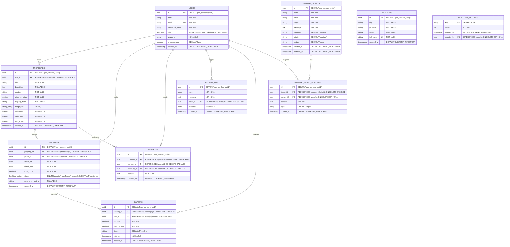

# Database Design Specification

This document outlines the PostgreSQL data layer architecture for the LuxeStay Platform, detailing relationships, schemas, indexes, and concurrency exclusions.

## 1. Overview

The data layer is built on **PostgreSQL** to guarantee transactional integrity and strict relational safety:
*   **Production:** Managed PostgreSQL instances (Supabase).
*   **Development/Testing:** Containerized PostgreSQL 15 instances inside Docker.

We enforce core business constraints (such as preventing double-bookings) at the database layer rather than relying purely on application-level logic to avoid race conditions.

---

## 2. Entity Relationship Diagram



---

## 3. Database Schema Definitions

### 3.1 `users`
Represents registered profiles. User roles dictate application access scopes.
*   `id`: UUID, Primary Key. Defaults to `gen_random_uuid()`.
*   `name`: VARCHAR(255), NOT NULL.
*   `email`: VARCHAR(255), Unique, NOT NULL.
*   `password_hash`: VARCHAR(255), NOT NULL.
*   `role`: user_role (ENUM: `'guest'`, `'host'`, `'admin'`), Defaults to `'guest'`.
*   `avatar_url`: TEXT, Nullable.
*   `is_suspended`: BOOLEAN, Defaults to `FALSE`.
*   `created_at`: TIMESTAMPTZ, Defaults to `CURRENT_TIMESTAMP`.

### 3.2 `properties`
Stores listings uploaded by hosts.
*   `id`: UUID, Primary Key.
*   `host_id`: UUID, Foreign Key referencing `users(id)` ON DELETE CASCADE.
*   `title`: VARCHAR(255), NOT NULL.
*   `description`: TEXT, Nullable.
*   `location`: VARCHAR(255), NOT NULL.
*   `price_per_night`: NUMERIC(10, 2), NOT NULL.
*   `property_type`: VARCHAR(100), Nullable.
*   `image_urls`: TEXT ARRAY (Supports multiple images).
*   `bedrooms`: INTEGER, Defaults to `1`.
*   `bathrooms`: INTEGER, Defaults to `1`.
*   `max_guests`: INTEGER, Defaults to `1`.
*   `created_at`: TIMESTAMPTZ, Defaults to `CURRENT_TIMESTAMP`.

### 3.3 `bookings`
Handles customer reservations. Protects key booking constraints via exclusion rules.
*   `id`: UUID, Primary Key.
*   `property_id`: UUID, Foreign Key referencing `properties(id)` ON DELETE RESTRICT.
*   `guest_id`: UUID, Foreign Key referencing `users(id)` ON DELETE CASCADE.
*   `check_in`: DATE, NOT NULL.
*   `check_out`: DATE, NOT NULL.
*   `total_price`: NUMERIC(10, 2), NOT NULL.
*   `status`: booking_status (ENUM: `'pending'`, `'confirmed'`, `'cancelled'`), Defaults to `'confirmed'`.
*   `payment_intent_id`: VARCHAR(255), Nullable.
*   `created_at`: TIMESTAMPTZ, Defaults to `CURRENT_TIMESTAMP`.

### 3.4 `messages`
Maintains records for user chats.
*   `id`: UUID, Primary Key.
*   `property_id`: UUID, Foreign Key referencing `properties(id)` ON DELETE CASCADE.
*   `sender_id`: UUID, Foreign Key referencing `users(id)` ON DELETE CASCADE.
*   `receiver_id`: UUID, Foreign Key referencing `users(id)` ON DELETE CASCADE.
*   `content`: TEXT, NOT NULL.
*   `created_at`: TIMESTAMPTZ, Defaults to `CURRENT_TIMESTAMP`.

### 3.5 `activity_log`
Provides an audit log of administrative or security adjustments.
*   `id`: UUID, Primary Key.
*   `type`: VARCHAR(50), NOT NULL. E.g., `'user'`, `'property'`, `'booking'`.
*   `message`: TEXT, NOT NULL.
*   `actor_id`: UUID, Foreign Key referencing `users(id)` ON DELETE SET NULL.
*   `metadata`: JSONB, Nullable.
*   `created_at`: TIMESTAMPTZ, Defaults to `CURRENT_TIMESTAMP`.

### 3.6 `locations`
Reference table to populate location search term query suggestions.
*   `id`: UUID, Primary Key.
*   `city`: VARCHAR(255), Nullable.
*   `province`: VARCHAR(255), Nullable.
*   `country`: VARCHAR(255), NOT NULL.
*   `full_name`: VARCHAR(255), Unique, NOT NULL. E.g. `"Malibu, USA"`.
*   `created_at`: TIMESTAMPTZ, Defaults to `CURRENT_TIMESTAMP`.

### 3.7 `support_tickets`
Maintains guest ticket submissions.
*   `id`: UUID, Primary Key.
*   `name`: VARCHAR(255), NOT NULL.
*   `email`: VARCHAR(255), NOT NULL.
*   `subject`: VARCHAR(255), NOT NULL.
*   `message`: TEXT, NOT NULL.
*   `category`: VARCHAR(100), Defaults to `'General'`.
*   `priority`: VARCHAR(50), Defaults to `'medium'`.
*   `status`: VARCHAR(50), Defaults to `'open'`.
*   `created_at`: TIMESTAMPTZ, Defaults to `CURRENT_TIMESTAMP`.
*   `updated_at`: TIMESTAMPTZ, Defaults to `CURRENT_TIMESTAMP`.

### 3.8 `support_ticket_activities`
Keeps track of messages, replies, and internal notes inside a support ticket.
*   `id`: UUID, Primary Key.
*   `ticket_id`: UUID, Foreign Key referencing `support_tickets(id)` ON DELETE CASCADE.
*   `admin_id`: UUID, Foreign Key referencing `users(id)` ON DELETE SET NULL.
*   `content`: TEXT, NOT NULL.
*   `type`: VARCHAR(50), Defaults to `'reply'` (public reply or internal note).
*   `created_at`: TIMESTAMPTZ, Defaults to `CURRENT_TIMESTAMP`.

### 3.9 `platform_settings`
Global configurations dynamically adjusted by administrative staff.
*   `key`: VARCHAR(100), Primary Key.
*   `value`: JSONB, NOT NULL. E.g., site name, commission percentage rates, maintenance mode toggles.
*   `updated_at`: TIMESTAMPTZ, Defaults to `CURRENT_TIMESTAMP`.
*   `updated_by`: UUID, Foreign Key referencing `users(id)` ON DELETE SET NULL.

### 3.10 `payouts`
Hosts financial accounts mapping earnings and service fees.
*   `id`: UUID, Primary Key.
*   `booking_id`: UUID, Foreign Key referencing `bookings(id)` ON DELETE CASCADE.
*   `host_id`: UUID, Foreign Key referencing `users(id)` ON DELETE CASCADE.
*   `amount`: NUMERIC(10, 2), NOT NULL (e.g. host's 90% share).
*   `platform_fee`: NUMERIC(10, 2), NOT NULL (e.g. platform's 10% fee).
*   `status`: VARCHAR(50), Defaults to `'pending'` (e.g., `'pending'`, `'paid'`, `'cancelled'`).
*   `paid_at`: TIMESTAMPTZ, Nullable.
*   `created_at`: TIMESTAMPTZ, Defaults to `CURRENT_TIMESTAMP`.

---

## 4. Concurrency Safety: Double-Booking Exclusion

To prevent race conditions where two threads try to book the same property for overlapping dates simultaneously, we enforce double-booking prevention at the database layer using a PostgreSQL **Exclusion Constraint** (`EXCLUDE USING gist`) on the `bookings` table:

```sql
ALTER TABLE bookings
ADD CONSTRAINT prevent_double_booking EXCLUDE USING gist (
    property_id WITH =,
    daterange(check_in, check_out, '[]') WITH &&
) WHERE (status = 'confirmed');
```

### How it operates:
*   The `btree_gist` extension allows combining scalar variables (like `property_id`) with range types.
*   `daterange(check_in, check_out, '[]')` creates an inclusive date range.
*   `&&` checks for range intersections (overlaps).
*   If a guest attempts to create a confirmed booking for a property that intersects with an existing confirmed booking, PostgreSQL immediately aborts the query and throws error code `23P01` (Exclusion Violation).

---

## 5. Performance Indexing Strategy

To keep query responses within targets (< 300ms latency), the schema includes the following indices:

1.  **Exclusion Index:** Enforced implicitly on the `bookings` table by the `prevent_double_booking` GIST constraint.
2.  **Filter Indices:**
    *   `CREATE INDEX idx_properties_location ON properties(location);` (Speeds up search terms).
    *   `CREATE INDEX idx_properties_host ON properties(host_id);` (Speeds up Host dashboard loading).
    *   `CREATE INDEX idx_bookings_guest ON bookings(guest_id);` (Speeds up Guest trips query).
    *   `CREATE INDEX idx_messages_conversation ON messages(property_id, sender_id, receiver_id);` (Optimizes chat message thread retrieval).
    *   `CREATE INDEX idx_support_activities_ticket ON support_ticket_activities(ticket_id);` (Speeds up ticket replies mapping).
    *   `CREATE INDEX idx_payouts_host ON payouts(host_id);` (Speeds up financial records queries).
    *   `CREATE INDEX idx_payouts_status ON payouts(status);` (Optimizes payment ledger runs).
