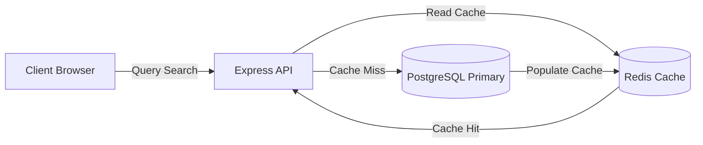

# Future Enhancements & Post-Implementation Roadmap

**Context:** This document outlines the strategic enhancements, architectural scaling, and production-hardening plans that would be implemented in a real-world enterprise deployment. These items were omitted from the current MVP to maintain a focused, minimal footprint for the assessment.

---

## 1. Codebase Modernization: TypeScript Migration

To scale this co-located feature monolith safely across a growing engineering team, migrating the entire codebase from JavaScript (ES6) to **TypeScript** is the primary codebase priority.

### 1.1 Frontend (React Client) Type Safety

- **Implementation:** Introduce strict component and state interface typings. Bind user session stores (Zod-derived types) to global context states.
- **Typing API Responses:** Define strict types for all Axios client responses, preventing UI failures caused by trying to access properties of undefined objects.
- **Strict Component Prop Guards:** Enforce TypeScript interfaces for reusable atomic elements (such as `Button`, `Input`, `Modal`) instead of relying on runtime `prop-types` checking.

### 1.2 Backend (Express API) Static Analysis

- **Implementation:** Define Data Transfer Objects (DTOs) for request payloads, linking Zod validation schemas directly to TypeScript interfaces:
  ```typescript
  type CreateBookingInput = z.infer<typeof createBookingSchema>;
  ```
- **Database Query Typing:** Define model-level return signatures mapping PostgreSQL raw query results (`pg.QueryResultRow`) to strict entity models (e.g., `UserRow`, `BookingRow`). This prevents column mapping errors during refactors.

---

## 2. Distributed Transaction Safety: Idempotency Keys

In a high-volume booking platform, double-booking and double-charging due to network retries (e.g., user clicks "Book Now" twice under unstable mobile networks) are critical failures.

### 2.1 API Idempotency Implementation

- **Protocol:** Introduce an `Idempotency-Key` header (UUID v4) for write operations (`POST /bookings`, `POST /finance/payouts/refund`).
- **Caching Layer (Redis):**
  1.  On receiving a request, the server checks Redis for the `Idempotency-Key`.
  2.  If the key is found, the server immediately returns the cached response (or returns `409 Conflict` if the original request is still executing).
  3.  If the key is missing, the server locks the key, processes the database transaction and external payment (Stripe), stores the result in Redis with a 24-hour TTL, and returns the response.
- **Impact:** Guarantees absolute correctness and safety, preventing duplicate financial transactions and overlapping DB records.

---

## 3. Advanced Caching Strategy (Redis)

To handle rapid search traffic and maintain low database load, a distributed caching layer is required.



### 3.1 Write-Through Cache for Property Listings

- **Implementation:** Cache public property search results (`GET /properties`) in Redis. Apply a short Time-To-Live (TTL) and enforce a write-through invalidation strategy: immediately clear the relevant cached searches when a host creates, updates, or deletes a property listing.
- **Impact:** Bypasses heavy database JOIN queries for repeat landing page searches, bringing response latency under 10ms.

### 3.2 O(1) Session & Revocation Blacklist

- **Implementation:** Keep active user suspension flags and blacklisted tokens in Redis. The Express JWT auth middleware will query Redis at O(1) speed for every authenticated request, avoiding unnecessary database hits on the `users` table.

---

## 4. Event-Driven Architecture & Message Queues

As chat activity, booking volume, and payout audits grow, synchronous HTTP execution will create database contention and slow down the request-response lifecycle.

### 4.1 RabbitMQ / Apache Kafka Integration

- **Roadmap:** Introduce an asynchronous message broker to decouple non-blocking tasks from the core transaction lifecycle:
  - **Notification Pipeline:** Publishing a booking generates an event to a queue, processed by workers to send push notifications and transactional emails (via SendGrid/Twilio).
  - **Audit Logging:** Activity logs are published to a high-throughput message pipeline (Kafka), allowing database writers to ingest and record logs in batches without delaying client API responses.
  - **Real-time Messaging Backplane:** Feed chat messages through RabbitMQ before broadcasting over Socket.IO to enable server-to-server load balancing.
- **Impact:** Guarantees sub-100ms API response times by handling heavy post-processing asynchronously.

---

## 5. Enterprise-Grade Security Hardening

### 5.1 Token Security & Session Lifecycle

- **JWT Access & Refresh Token Rotation:**
  Currently, stateless JWTs cannot be revoked until expiration. Upgrade to a two-token system:
  - **Access Token:** Short-lived (15 minutes), passed via headers.
  - **Refresh Token:** Long-lived (7 days), stored in a secure, `HttpOnly`, `SameSite=Strict`, encrypted cookie.
  - **Rotation:** Implement Refresh Token Rotation (each usage invalidates the old refresh token and issues a new one). If a reuse is detected, all sessions for that user are immediately revoked (session hijacking prevention).

### 5.2 Encryption-at-Rest & Column-Level Hashing

- **Implementation:** Use PostgreSQL's `pgcrypto` or application-layer AES-256 encryption keys to encrypt sensitive fields (e.g., payout billing references, payout accounts, and contact details) before storage.
- **Impact:** Protects personal identifiable information (PII) from database leaks or read-access exposures.

### 5.3 Automated Prevention of IDOR & XSS

- **Insecure Direct Object Reference (IDOR) Protection:** Implement strict request-level owner matching. Route handlers must verify that the authenticated `req.user.id` is explicitly authorized to mutate or access the specific database entity ID (e.g., checking host ownership on properties and guest ownership on bookings).
- **Cross-Site Scripting (XSS) Sanitization:** Enforce strict backend sanitization on string inputs (especially listing descriptions and chat messages) using libraries like `DOMPurify` (run at the validation middleware layer) to purge malicious scripts before they reach the database.

---

## 6. Integration Roadmap

### 6.1 Stripe Escrow & Payout Webhooks

- **Implementation:** Replace simulated payment fields with a complete Stripe Payment Intents flow.
- **Escrow System:** Hold guest payments in escrow upon booking confirmation. Stripe transfer webhooks will automatically release funds to the host's Stripe Express account 24 hours after the guest's check-in date.

### 6.2 Object Cloud Storage (AWS S3)

- **Implementation:** Replace local server disk uploads (`/uploads`) with AWS S3, Google Cloud Storage, or Supabase Storage. Set up client-side pre-signed URL uploads so files are uploaded directly from the browser to S3, bypassing backend load.
- **Impact:** Keeps backend containers completely stateless (which is a requirement for autoscaling on Railway/Kubernetes) and improves file access security.
