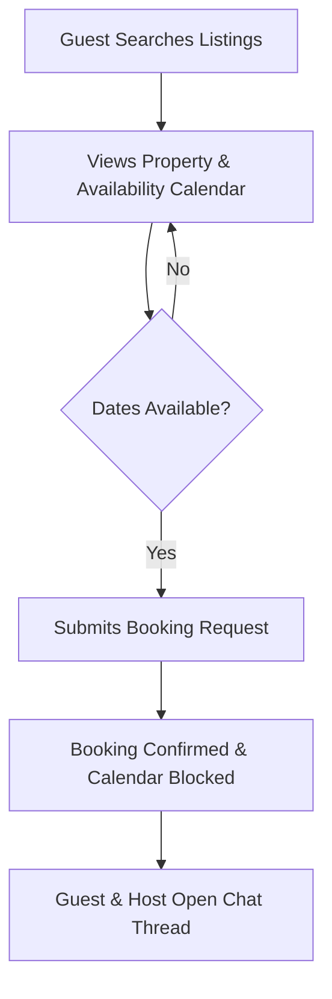

# Product Definition & System Boundary

## 1. Product Summary

The target product is a **Property Rental Platform** designed to connect guests seeking short-term accommodation with hosts wishing to list and rent out their spaces. The system functions as a simplified marketplace (similar to Airbnb).

### The Problem
Fragmentation, lack of trust, and booking friction in the short-term rental market. 

### The Solution
A unified, reliable web application that streamlines property discovery, real-time booking availability check, and guest-host communication.

---

## 2. Core Users & Roles

The system enforces strict role-based access control (RBAC) across three distinct user roles:

| Role | Responsibility | Permitted Actions (In-Scope) | Restrictive Boundaries |
| :--- | :--- | :--- | :--- |
| **Guest / Renter** | Discovering spaces and securing bookings. | • Search & filter listings by location/price • View property details & availability • Create bookings • Message hosts • Submit support tickets | • Cannot create/edit listings • Cannot view other users' bookings • No access to owner/admin dashboards |
| **Host / Owner** | Managing listings and fulfilling bookings. | • Create, edit, and delete own listings • Upload property images • View incoming bookings & details • Access host dashboard / property records | • Cannot modify other hosts' listings • Cannot access administrative settings |
| **Admin** | Maintaining platform safety & compliance. | • View all users, listings, and bookings • Remove fraudulent/inappropriate listings • Suspend or modify user accounts • Respond to support tickets • Review global settings and payouts | • Cannot book properties on behalf of users • Cannot override system double-booking constraints |

---

## 3. Core User Journeys

### A. Guest: Discover & Book
1. **Browse & Search:** Guest enters search parameters (e.g., location, price range).
2. **Details & Availability:** Guest views property profile, images, amenities, pricing breakdown, and available dates.
3. **Reservation:** Guest selects available dates, views the total price, and confirms the booking. The calendar updates immediately.

### B. Host: List & Manage
1. **Creation:** Host publishes a listing by inputting title, description, location, night price, and images.
2. **Dashboard Management:** Host reviews reservations, manages listing details, and manually views properties.

### C. Unified: Communication Loop
1. **Inquiry:** A guest initiates a message from the property listing page.
2. **Conversation Thread:** The system opens a unique chat thread between the guest and host, pinned to that specific property.
3. **Fulfillment:** Host and guest discuss details within the platform, keeping communication secure.

---

## 4. MVP System Scope (In-Scope)

The LuxeStay platform contains the following modules:
*   **Identity & Authentication:** Secure JWT-based authentication with role assignment (Guest, Host, Admin).
*   **Property Catalog:** Full CRUD operations for listings (restricted by ownership), location search, and price filtering.
*   **Booking Engine:** Transaction-safe booking creation with check-in/check-out dates.
*   **Double-Booking Prevention:** Hard database-level checks using PostgreSQL GIST constraints preventing overlapping confirmed bookings.
*   **Messaging System:** Persistent communication linked to Guest-Host-Property tuples with real-time Socket.IO synchronization.
*   **Support Tickets:** Complete ticketing workflow for guest inquiries and administrative resolutions.
*   **Host Dashboard:** Specialized UI tracking bookings, reservations, and listing properties.
*   **Administrative Portal:** Full control panel mapping platform stats, user suspension controls, settings overrides, payout approvals, refund triggers, and ticket activity notes.
*   **Containerization & Deployment:** Local container environment definitions (Docker / Docker Compose) for streamlined local orchestration.

---

## 5. Out of Scope (Pragmatic Exclusions)

To maintain focus on core software quality, testing, and system correctness, the following are intentionally deferred:
*   **Payment Gateways:** Credit card processing integrations (Stripe/PayPal) are simulated (assumed successful checkouts for MVP).
*   **Reviews & Ratings:** User/listing reviews and ratings are deferred to post-MVP.
*   **Advanced Chat Features:** Typing indicators, message read receipts, and file attachments in chat.
*   **Dynamic Pricing:** High-season markup or custom weekend rates.

---

## 6. Codebase Transition & Integration Status (Completed)

The codebase has been fully refactored, resolving all modular gaps between the frontend and backend:

| Milestone | Legacy State (Audit) | Current Refactored State | Status |
| :--- | :--- | :--- | :--- |
| **Domain Model** | Backend modeled around bidding/auctions (`Product`, `bidHistory`). | Backend modeled around short-term rentals (`Property`, `Booking`). | **100% Completed** |
| **Data Integration** | Frontend used static mock data (`villas.js`). | Frontend fetches dynamically from Express API using React Query & Axios. | **100% Completed** |
| **Security Risks** | Suspicious remote code execution logic in controllers. | Strictly secure local controller logic. Vulnerability vectors eliminated. | **100% Completed** |
| **Dependencies** | Legacy Web3 and unused SQLite dependencies. | Clean dependency graph (PostgreSQL client, Express, Zustand, React Query). | **100% Completed** |
| **Deployment & IaC** | Manual server setups. | Containerized (Docker Compose) local orchestration. | **100% Completed** |

---

## 7. Product Constraints & Assumptions

*   **Pricing Consistency:** Multi-currency is deferred. All transactions are assumed in a single base currency (USD).
*   **Booking Integrity:** A property calendar lock is absolute. Overlapping check-in/check-out boundaries are rejected server-side.
*   **Identity Boundary:** Anonymous users can browse and search, but *must* authenticate before booking or messaging.
*   **Ownership Integrity:** A host can only edit or delete listings they created.

---

## 8. Definition of Done (DoD) - Verification Summary

All implementation requirements have been met and verified:
1.  **Fully Integrated Flow:** Guests can search, view properties, book, and message hosts with live network operations.
2.  **No Mock Data:** The UI fetches all property listings and bookings from the PostgreSQL database.
3.  **Concurrency Checked:** The backend database rejects double-booking attempts via GIST constraints.
4.  **No Security Risk:** Remote execution vectors are completely eliminated and dependency locks are pruned.
5.  **High Test Coverage:** Core booking and authentication endpoints have robust unit and integration tests (all 45/45 tests pass).