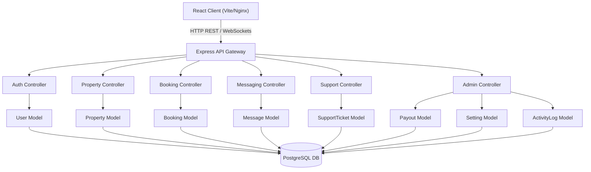
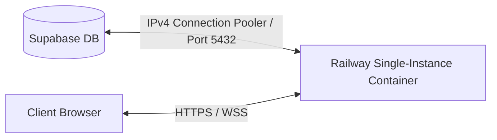

# System Architecture (LuxeStay Platform)

## 1. Architectural Style: Co-located Feature-Driven Monolith

For this application, we have implemented a **Co-located Feature-Driven Monolith** architecture. 
*   **Backend:** Express.js API layer structured with MVC pattern and direct encapsulation in Model layers.
*   **Frontend:** React client built with Vite and structured using a scalable **Feature-Based Modular Architecture** (decoupling domain code into feature folders).
*   **Containerization & Orchestration:** Local environment containerization and full-stack orchestration via Docker/Docker Compose.

This architecture ensures high execution speed, straightforward local execution, and structural decoupling without the premature infrastructure overhead of microservices.

---

## 2. Technology Stack

*   **Frontend Framework:** React (Vite build) – component reusability and modern fast compiler.
*   **Frontend State & Cache:** Zustand (stateless authentication/user session store) + React Query/TanStack Query (server state cache, loading states, mutation invalidation).
*   **Backend API:** Node.js + Express – lightweight REST API and WebSocket gateway.
*   **Database:** PostgreSQL – ensures strict relational integrity (ACID compliance) and exact concurrency exclusion constraints (to prevent booking collisions).
    *   *Development:* Containerized PostgreSQL 15 database.
    *   *Production:* Supabase PostgreSQL database.
*   **Authentication:** JWT (Stateless) – signature-verified authorization headers.
*   **Real-time:** Socket.io – WebSocket integration for guest-host chat messaging.
*   **Containerization:** Docker & Docker Compose – standardized container runtimes.
*   **Orchestration:** Docker Compose (Local Full Stack).
*   **Cloud Deployment:** Railway (Single-instance container hosting).

---

## 3. Core System Components



### 3.1 Frontend Architecture (React)
The frontend uses a scalable feature-module pattern:
*   **`src/app`**: Global orchestration, router definitions, and top-level layouts (Main, Admin, Host, Auth).
*   **`src/features`**: Decoupled, self-contained business modules (e.g., `admin`, `properties`, `trips`, `hosting`). Each feature folder contains its own local `components/`, `pages/`, `hooks/`, `api/`, and/or `store/`.
*   **`src/shared`**: Reusable component widgets (Button, Input, Dropdown, Modal, ProtectedRoute, Navbar, Footer) and shared utility libraries (Axios client, dates, currency).

### 3.2 Backend Architecture (Express)
The backend decouples HTTP controller logic from database operations:
*   **Routes (`server/routes/`)**: Map endpoints, parse parameters, and apply middleware (Auth role-guarding, input validators).
*   **Controllers (`server/controllers/`)**: Handle HTTP request extraction, route execution parameters, and format JSON responses.
*   **Models (`server/models/`)**: Encapsulate database interactions. Contains SQL queries, parameter bindings, and transaction operations.
*   **Middleware (`server/middleware/`)**: Encapsulates session verification, schema validation gates, and global error handling.

---

## 4. Key Architectural Decisions (ADRs)

### ADR 1: Relational Database over NoSQL
*   **Context:** The legacy codebase used MongoDB/Mongoose.
*   **Decision:** PostgreSQL for database management.
*   **Rationale:** Rental platforms require strict ACID guarantees. We use PostgreSQL's `exclude` constraint with `gist` index to mathematically prevent double-booking conflicts at the database table level (concurrency safety).

### ADR 2: Stateless JWT Authentication
*   **Decision:** Stateless token authentication.
*   **Rationale:** Eliminates backend session storage. The middleware verifies token signature and decodes user identifiers and roles (admin, host, guest) dynamically.

### ADR 3: Conditional Database SSL
*   **Decision:** Auto-configured SSL connections based on connection targets.
*   **Rationale:** Local Docker containers do not run SSL. The connection pools dynamically disable SSL if connecting to `localhost`, `127.0.0.1`, `db:5432` container links, or if `DB_SSL=false` is set, preserving mandatory SSL checks for cloud servers (Supabase/Production).

### ADR 4: Cross-Origin Resource Sharing (CORS) Restriction
*   **Decision:** Restrict CORS origins strictly to local development URLs, but dynamically whitelist Railway subdomains (`*.railway.app` / `*up.railway.app`) in production environments.
*   **Rationale:** Enforces local development environment security while allowing headless and staging/preview deployments on cloud platforms without manual variables sync.

### ADR 5: Single-Instance Production Image
*   **Decision:** Run frontend build step (`npm run build`) directly inside the backend container (`Dockerfile.server`) at build-time, and serve static assets via Node (`express.static`) in cloud environments.
*   **Rationale:** Eliminates multi-service subscription complexity in hosting providers (like Railway) by enabling a unified API and web container, which lowers latency and simplifies deployment.

---

## 5. Critical System Flows

### 5.1 Booking Concurrency Control
Double-bookings are rejected at the data layer using PostgreSQL exclusion rules:
1.  **Request:** Guest sends check-in and check-out dates.
2.  **Constraint Validation:** The `prevent_double_booking` constraint:
    ```sql
    CONSTRAINT prevent_double_booking EXCLUDE USING gist (
        property_id WITH =,
        daterange(check_in, check_out, '[]') WITH &&
    ) WHERE (status = 'confirmed')
    ```
3.  **Result:** If dates overlap, Postgres throws error code `23P01`. The backend catches it and returns HTTP 409 (Conflict), guaranteeing no double-bookings can occur.

### 5.2 Real-Time Chat Messaging
1.  **Handshake:** Client initiates persistent Socket.IO connection.
2.  **Persistence:** Message payloads are saved to the database via REST API first.
3.  **Broadcast:** Upon successful write, the backend emits the message over the socket connection to notify the recipient in real-time.

---

## 6. Infrastructure & Deployment Model



The application is deployed using a single-instance container infrastructure:
*   **Container Runtime:** Debian-based `node:20-slim` to allow node native compilation (Tailwind v4 binaries) while optimizing container image size.
*   **Database Gateway:** Routed via Supabase Connection Pooler (`aws-0-[region].pooler.supabase.com:5432`) to bypass IPv6 container network restrictions.
*   **Railway configuration:** Controlled via root `railway.json` to force Dockerfile builders.
*   **Helmet & CSP configuration:** Disables CSP to allow Unsplash image caching and WebSocket handshakes from the browser client.

---

## 7. Codebase Directory Structure (Technical Layout)

```text
├── src/                        # React Frontend (Feature-based Modular Architecture)
│   ├── app/                    # Application configuration, layouts, and routing
│   │   ├── layouts/            # Global page layout shells (Admin, Auth, Main, Host)
│   │   ├── providers/          # Global context providers (React Query)
│   │   └── router/             # Page router configuration
│   ├── features/               # Domain-specific feature modules
│   │   ├── auth/               # User registration, login, state store, and authentication api
│   │   ├── admin/              # Admin-specific components, pages (dashboard, users, properties, support)
│   │   ├── hosting/            # Host dashboard, reservation management, properties list
│   │   ├── trips/              # Guest trip history, tickets, cancellations
│   │   ├── properties/         # Property listings, details page, reviews, filters
│   │   ├── messages/           # Chat list and thread messages
│   │   └── ...                 # Other features (home, contact, about, bookings)
│   ├── shared/                 # Reusable layout and utility definitions
│   │   ├── components/         # Shared visual widgets (Navbar, Footer, Modal, Button, etc.)
│   │   ├── hooks/              # Shared logic hooks (scroll reveals)
│   │   ├── lib/                # Shared API clients (axios, socket, queryClient)
│   │   └── utils/              # Reusable data/date formatters
│   ├── styles/                 # Global styling config (Tailwind v4)
│   ├── App.jsx                 # App entry coordinator
│   └── main.jsx                # Web root mount point
│
├── server/                     # Express Backend Monolith Domain
│   ├── controllers/            # HTTP handlers validating payload and triggering models
│   ├── db/                     # DB schemas and migrations (schema.sql)
│   ├── middleware/             # Route guards, error handling, session verifiers
│   ├── models/                 # Direct database query layers (PostgreSQL client)
│   └── routes/                 # Express Router endpoint definitions
│
├── scripts/                    # Database seeding and migration helper scripts
├── app.js                      # Backend API server configuration and mount point
├── package.json                # Shared backend/frontend dependency config
├── Dockerfile.server           # Docker configuration for Express API server
├── Dockerfile.client           # Docker configuration for Vite client Nginx server
├── railway.json                # Railway build and deploy configuration
├── nginx.conf                  # Nginx proxy mapping client assets and fallback routes
└── docker-compose.yml          # Container composer for local environment runs
```
